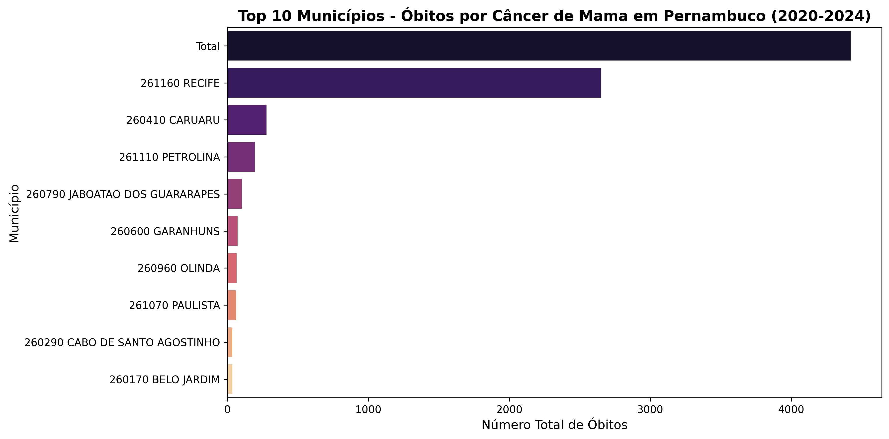

# Análise de Mortalidade por Câncer de Mama em Pernambuco (2020–2024)

Repositório dedicado à análise exploratória de dados de saúde pública focada na mortalidade por câncer de mama no estado de Pernambuco, utilizando bases de dados oficiais do **DATASUS (SIM - Sistema de Informações sobre Mortalidade)**.

O objetivo principal desta etapa é identificar e destacar os municípios pernambucanos que concentraram o maior volume absoluto de óbitos no período recente, auxiliando na visualização da distribuição espacial dos impactos da doença no estado.

---

## Tecnologias Utilizadas
Projeto desenvolvido em **Python** utilizando o ambiente em nuvem **Google Colab** e bibliotecas especializadas em ciência de dados:
* **Pandas**: Para limpeza, tratamento, filtragem e agregação do dataset.
* **Seaborn & Matplotlib**: Para a construção da visualização gráfica dos dados.

---

## 📈 Principais Resultados

### Top 10 Municípios com Maior Número de Óbitos
O gráfico abaixo apresenta as 10 cidades do estado de Pernambuco com o maior registro de óbitos por câncer de mama entre 2020 e 2024:

---

## 👤 Autor
Desenvolvido por **Hellen Eustáquio**.
